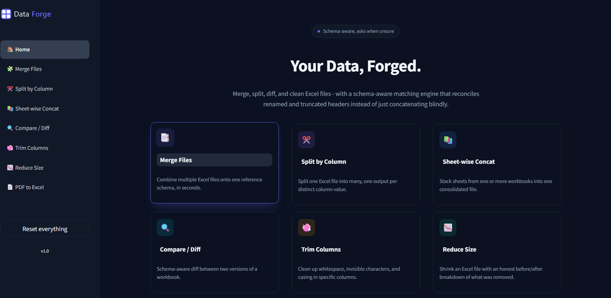

# Data Forge

Nine Excel and PDF tools that handle the messy, manual cleanup work analysts do by hand every day: reconciling inconsistent headers, splitting bloated workbooks, diffing two versions of a file, pulling tables out of PDFs, and consolidating LCC and CIBIL reports. One Streamlit app, zero setup beyond `pip install`.

**Live app:** https://getdataforge.streamlit.app/



## Why this exists

Anyone who has merged exports from five different systems knows the real problem is never the data, it's the headers. `Customer Name` in one file becomes `Cust_Name` in another and `CustomerNm` in a third. Most tools force you to fix that by hand, in Excel, one column at a time.

This app's merge and split tools are schema aware: they match renamed and truncated headers automatically, rank the ones they aren't sure about by similarity, and only ask you to resolve the genuine ambiguity, not retype every column name.

## Tools

| Tool | What it does |
|---|---|
| **Merge Files** | Combine multiple Excel files onto one reference schema, with automatic header reconciliation. |
| **Split by Column** | Split one Excel file into many, one output per distinct value in a chosen column. |
| **Sheet-wise Concat** | Stack sheets from one or more workbooks into a single consolidated file. |
| **Compare / Diff** | Schema-aware diff between two versions of a workbook, at the column and row level. |
| **Trim Columns** | Clean whitespace, invisible characters, and inconsistent casing in specific columns. |
| **Reduce Size** | Shrink an oversized Excel file with an honest before/after breakdown of what was removed. |
| **PDF to Excel** | Pull tables out of a PDF, text layer or scanned, into a real Excel workbook. |
| **LCC to Master Excel** | Consolidate LCC PDFs into one master Excel file. Opens in a separate app. |
| **CIBIL to Excel** | Extract CIBIL report data into Excel. Opens in a separate app. |

## Running locally

```bash
pip install -r requirements.txt
streamlit run app.py
```

The app opens at `http://localhost:8501`. Nothing is persisted server side beyond the current browser session: no database, no file storage, no backend API.

## Notes on the PDF to Excel tool

Table extraction works out of the box for any PDF with a text layer. Scanned or photographed PDFs need OCR, which uses `rapidocr` (bundled in `requirements.txt`) or a locally installed Tesseract as a fallback. If neither is present, the app tells you exactly what to install rather than failing silently.

## Tech

Python, Streamlit, pandas, openpyxl/xlsxwriter for Excel I/O, pdfplumber and img2table for PDF table extraction.
